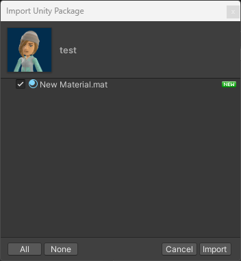

# Add Icon to UnityPackage

This is a simple action, that sets the icon of a UnityPackage *(see example below)*.
Licensed under [GNU GPL v3 or later](https://spdx.org/licenses/GPL-3.0-or-later.html).



## Inputs

| Required | Parameter                    | Description                                                    | Type                    | Default |
| :------: | :--------------------------- | :------------------------------------------------------------- | :---------------------- | :------ |
|    ✓     | `package_path`               | Path to the UnityPackage. Will be overwritten with the result. | string                  |         |
|    ✓     | `icon_path`                  | Path to the icon file.                                         | string                  |         |
|          | `icon_not_found_behavior`    | What to do if the icon file is not found.                      | [`behavior`](#behavior) | `fail`  |
|          | `package_not_found_behavior` | What to do if the package file is not found.                   | [`behavior`](#behavior) | `fail`  |

### Behavior

| Value | Description |
| --- | --- |
| `fail` *(default)* | Throws an error, stops the workflow. |
| `warn` | Prints a warning, skips this step. |
| `ignore` | Do nothing, skip this step. |

## Setup

Add the following snippet to your workflow file, with the appropriate parameters:

```yml
- name: Add Icon to UnityPackage
  uses: foxscore/add-icon-to-unitypackage@v1
  with:
    package_path: 'path/to/your/package.unitypackage'
    icon_path: 'path/to/your/icon.png'
    icon_not_found_behavior: 'fail'
    package_not_found_behavior: 'fail'
```

### Example

> **Assuming that you**
>
> - are using the [VPM Package Template](https://github.com/vrchat-community/template-package), in which case the file to edit is `.github/workflows/release.yml`.
> - have a file called `icon.png` in the `resources` folder.

```yml
    # [...]

      - name: Create UnityPackage
        uses: pCYSl5EDgo/create-unitypackage@cfcd3cf0391a5ef1306342794866a9897c32af0b
        with:
          package-path: ${{ env.unityPackage }}
          include-files: metaList
        
        # This is where we insert the action
      - name: Add Icon to UnityPackage
        uses: foxscore/add-icon-to-unitypackage@v1
        with:
          package_path: ${{ env.unityPackage }}
          icon_path: 'resources/icon.png'
        # end of action
        
      - name: Make Release
        uses: softprops/action-gh-release@1e07f4398721186383de40550babbdf2b84acfc5
        with:
          tag_name: ${{ steps.version.outputs.prop }}
          files: |
            ${{ env.zipFile }}
            ${{ env.unityPackage }}
            Packages/${{ env.packageName }}/package.json
```
